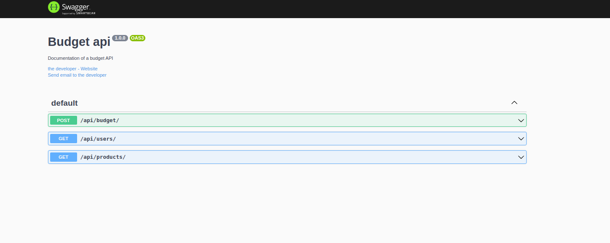

# Budget API



# Context

API for listing users and products and for budget calculation.

## Technologies

* NodeJS
* ExpressJS
* TypeScript
* Docker
* Axios
* Swagger
* Jest
* Supertest
* Ts-node-dev
* Rimraf

# Running Application

## Cloning Repo

```
  git clone git@github.com:DouglasD18/budget-api.git
  cd budget-api
  ```

## Running with Docker

* Buildando o Dockerfile
  ```
  docker build -t budget-api .
  ```

* Rodando a aplicação
  ```
  docker run -it -p 3333:3333 budget-api:latest
  ```

## Running without Docker

### Install Dependencies

```bash
npm install
``` 

### Exec Application

* To run the API:

  ```
  npm start
  ```

* To run the API's tests:

  ```
  npm run test
  ```

Application running at port http://localhost:3333/
